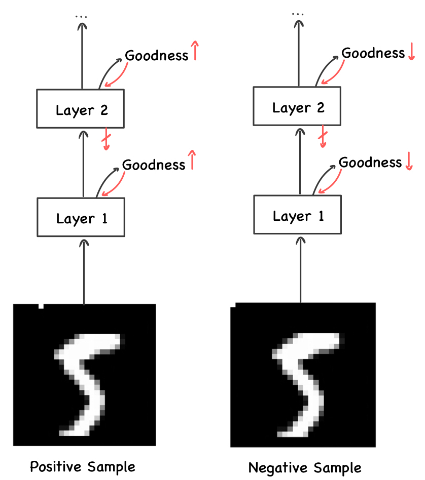

# Reimplementation of the Forward-Forward Algorithm

This is a reimplementation of Geoffrey Hinton's Forward-Forward Algorithm in Python/Pytorch.

&rarr; [Original Paper](https://arxiv.org/abs/2212.13345)

&rarr; [Official Matlab Implementation](https://www.cs.toronto.edu/~hinton/)

This code covers the experiments described in section 3.3 ("A simple supervised example of FF") of the paper and 
achieves roughly the same performance as the official Matlab implementation (see Results section).


## The Forward-Forward Algorithm

The Forward-Forward algorithm is a method for training deep neural networks in a more biologically plausible manner.
Instead of sharing gradients between layers, it trains each layer based on local losses. 

To implement these local losses, the network performs two forward passes:
The first forward pass is on positive samples, which are representative of the "real" data. 
For these samples, the network is trained to maximize the "goodness" for each of its layers. 
In the second forward pass, the network is fed negative samples, 
which are data perturbations that do not conform to the true data distribution. 
For these samples, the network is trained to minimize the "goodness".

The goodness can be evaluated in several ways, such as by taking the sum of the squared activities of a layer.



The image above depicts the training of a network with the Forward-Forward algorithm as implemented in this repository. 
Here, the positive and negative samples are created by adding a one-hot encoding of the correct or incorrect label 
to the first ten pixels of the image.


## How to Use

### Setup
- Install [conda](https://www.anaconda.com/products/distribution)
- Adjust the ```setup_conda_env.sh``` script to your needs (e.g. by setting the right CUDA version)
- Run the setup script:
```bash
bash setup_conda_env.sh
```


### Run Experiments
- Run the training and evaluation with forward-forward:
```bash
source activate FF
python -m main
```


## Results
Comparison of the results for different implementations of the Forward-Forward algorithm:

| | Test Error (%) |
| --- | -- |
| Paper | 1.36 |
| Official Matlab Implementation | 1.47 |
| This Repo | 1.45 |
